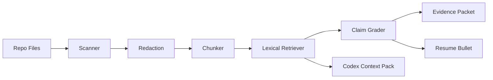

# Codex Evidence RAG Plugin

Made by `zrt219`.

Codex Evidence RAG is a local, dependency-light claim-auditing tool for AI engineering portfolios. It scans a repository, retrieves source-backed evidence, grades claim strength, and emits recruiter-safe evidence packets and Codex context packs.

This is a Codex-compatible local plugin/CLI. It does not require API keys, embeddings, a vector database, or private workspace data.

## Links

- GitHub: https://github.com/zrt219
- LinkedIn: https://www.linkedin.com/in/zhane-grey-987258395
- Portfolio hub: https://beacons.ai/zrt_219
- Evidence dashboard: https://zhane-grey-evidence-dashboard.vercel.app/
- Build Doctor: https://vercel-build-doctor-agent.vercel.app/build-doctor
- Resume Tailor: https://ai-resume-tailor-service.vercel.app/
- DatumX: https://datumx.vercel.app

## ELI5: What this does

This tool is a proof checker for a resume.

1. Point it at a code folder.
2. It reads safe text/code files.
3. You ask, "Can I claim this skill?"
4. It finds the files that support the claim.
5. It grades the claim as `STRONG`, `MEDIUM`, `WEAK`, or `UNVERIFIED`.
6. It writes a clean evidence packet you can show or use while applying to jobs.

For an employer, the signal is simple: this project does not just write polished AI claims. It checks whether the claim is backed by source files, tests, docs, and safe citations.

## Why it exists

Most portfolio and resume automation fails at the trust boundary: it can write polished claims, but it cannot prove them. This tool keeps the source of truth local and asks a stricter question:

> What files, tests, docs, or configs prove this claim?

## Quickstart

### Basic basic Windows steps

Open PowerShell in this repo, then run:

```powershell
python -m venv .venv
.\.venv\Scripts\Activate.ps1
pip install -e .[dev]
```

Try the demo repo:

```powershell
codex-evidence scan --root examples\fixture_repo
codex-evidence --root examples\fixture_repo ask "Can I claim RAG eval experience?"
codex-evidence --root examples\fixture_repo bullet "RAG retrieval context system"
codex-evidence --root examples\fixture_repo packet "RAG retrieval context system"
codex-evidence --root examples\fixture_repo context-pack "Add tests for the claim grader"
```

You can also run the module directly:

```powershell
python -m codex_evidence_rag --help
```

If you are in an offline or locked-down Windows environment without `wheel` installed, use the legacy editable path:

```powershell
pip install -e . --no-use-pep517
```

## CLI Commands

| Command | Purpose |
|---|---|
| `scan` | Build `.codex-evidence/index.json` from local source files. |
| `ask` | Retrieve evidence and grade whether a claim is supported. |
| `bullet` | Generate a resume-safe bullet backed by the top source path. |
| `packet` | Write `.codex-evidence/evidence_packet.md`. |
| `context-pack` | Write `.codex-evidence/context_pack.md` for a Codex task. |

## Claim Grades

| Grade | Meaning |
|---|---|
| `STRONG` | Code/test/config evidence directly supports the claim. |
| `MEDIUM` | Multiple relevant matches support qualified wording. |
| `WEAK` | Evidence is related but not enough for strong resume wording. |
| `UNVERIFIED` | Do not use the claim on a resume yet. |

## Architecture



## Demo Transcript

```txt
> codex-evidence scan --root examples\fixture_repo
Indexed 3 files into examples\fixture_repo\.codex-evidence\index.json
Chunks: 3 | Skipped files: 0

> codex-evidence --root examples\fixture_repo ask "Can I claim RAG eval experience?"
Claim grade: MEDIUM
1. examples/fixture_repo/README.md:1
...

> codex-evidence --root examples\fixture_repo bullet "RAG retrieval context system"
Built rag retrieval context system with supporting local evidence, backed by `README.md`.
```

## Resume Positioning

Resume-safe bullet:

```md
Built a Codex-compatible RAG evidence plugin that scans local repositories, retrieves source-backed proof, grades claim confidence, and generates recruiter-safe evidence packets and Codex context packs.
```

## Public-Safety Defaults

- Ignores `.git`, `.venv`, `node_modules`, `dist`, `build`, `.next`, caches, and generated `.codex-evidence` state.
- Redacts common API keys, tokens, private keys, database URLs, JWT-like tokens, and raw Windows user paths.
- Uses relative paths in public outputs.
- Ships only safe fixture data.

## Security Audit

This repo includes a security audit report and tests:

- `SECURITY_AUDIT.md` documents the threat model, controls, and audit result.
- `tests/test_security_audit.py` checks public repo hygiene, generated-state ignore rules, and redaction behavior.

Current audit result: no known secrets are required, no network calls are made by the CLI, generated indexes are gitignored, and public outputs use relative paths.

## Roadmap

- Optional Chroma embedding adapter.
- Optional LangGraph claim-review workflow.
- Optional OpenAI embedding/provider adapter.
- MCP surface for direct agent use.
- GitHub Action that publishes evidence packets for public repos.
